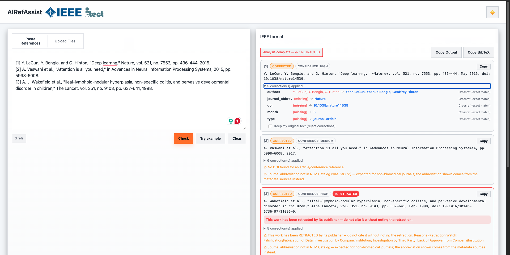
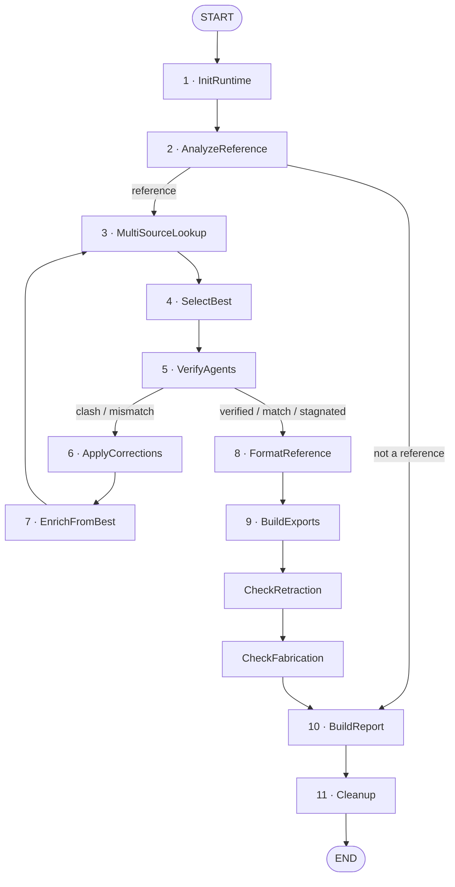
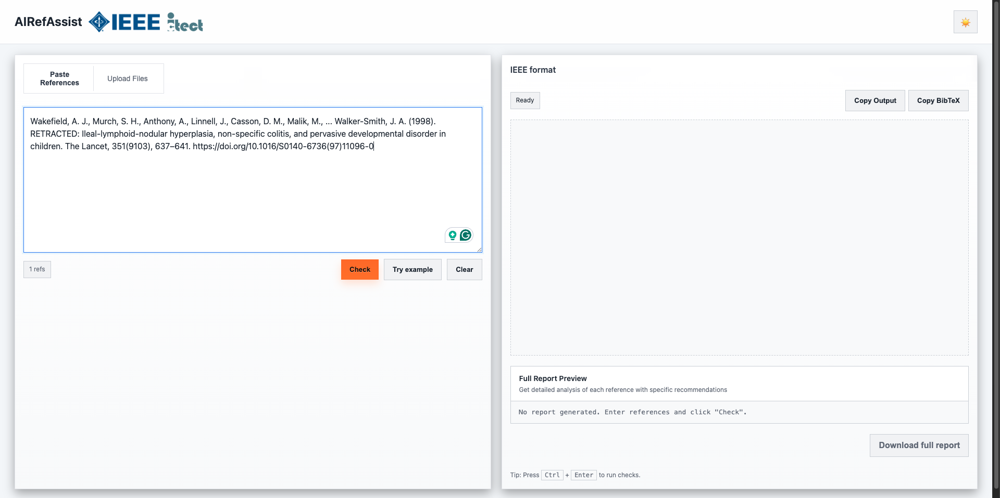

# RefAssist

**Agentic reference verification and IEEE-compliant formatting powered by LLMs and 14 authoritative sources**

RefAssist validates bibliographic references against authoritative metadata, corrects
errors with field-level provenance and confidence scores, flags retracted and
fabricated works, and formats the result to IEEE style.



## The Problem

Bibliographic references are error-prone. Typos, incomplete citations, wrong volumes, missing DOIs—these errors propagate through documents and hide retracted works until peer review catches them (if at all).

Most tools format references mechanically. **RefAssist goes deeper:** it validates references against authoritative metadata, corrects errors with confidence scores, and flags retracted works—then formats to IEEE style with full field-level provenance.

## The Pipeline

RefAssist is a LangGraph state machine. `AnalyzeReference` short-circuits anything
that isn't a reference; `VerifyAgents` loops back through lookup until the record
stops improving, then falls through to formatting and the integrity checks.



<details>
<summary>Same graph as plain text</summary>

```
[START]
   │
   ▼
1. InitRuntime
   │
   ▼
2. AnalyzeReference ──(not a reference)──────────┐
   │                                             │
   ▼                                             │
3. MultiSourceLookup ◄────────────┐              │
   │                              │              │
   ▼                              │              │
4. SelectBest                     │              │
   │                              │              │
   ▼                              │              │
5. VerifyAgents ──(clash/mismatch)──► ApplyCorrections
   │                              │              │
(verified/match/stagnated)        │              │
   │                        EnrichFromBest       │
   ▼                                             │
6. FormatReference (IEEE)                        │
   │                                             │
   ▼                                             │
7. BuildExports                                  │
   │                                             │
   ▼                                             │
8. CheckRetraction (Retraction Watch)            │
   │                                             │
   ▼                                             │
9. CheckFabrication (fake reference detection)   │
   │                                             │
   ▼                                             │
10. BuildReport ◄────────────────────────────────┘
   │
   ▼
11. Cleanup
   │
   ▼
 [END]
```

</details>

Node implementations live in `refassist/src/refassist/nodes/`; the graph itself is
assembled in [`refassist/src/refassist/graphs/pipeline.py`](refassist/src/refassist/graphs/pipeline.py).
The diagram above is kept in sync by hand — to verify it against the live graph, or
to render a standalone PNG:

```bash
# Print the Mermaid source LangGraph derives from the compiled graph
PYTHONPATH=refassist/src python -c \
  "from refassist.graphs.pipeline import build_graph; \
   print(build_graph().compile().get_graph().draw_mermaid())"

# Or write outputs/pipeline_graph.png (renders via the mermaid.ink service)
PYTHONPATH=refassist/src python -c \
  "from refassist.graphs.pipeline import save_graph_png; print(save_graph_png())"
```

| Node | Role |
|------|------|
| **InitRuntime** | Load configuration, initialize the LLM provider |
| **AnalyzeReference** | Single LLM pass: is this a reference, and what type (journal / conference / book / preprint / dataset)? Replaces a previous 3-call chain |
| **MultiSourceLookup** | Parallel queries to all 14 sources |
| **SelectBest** | Gated consensus: best match per field, weighted by source agreement |
| **VerifyAgents** | Cross-field validation (volume/issue/pages must align, etc.); decides loop-or-exit |
| **ApplyCorrections** | Merge corrections with confidence scores |
| **EnrichFromBest** | Feed the improved record back into lookup for another pass |
| **FormatReference** | Deterministic, rule-based IEEE formatting |
| **BuildExports** | Output to JSON, .docx, plain text |
| **CheckRetraction** | Flag retractions via Retraction Watch + OpenAlex + Crossref + PubMed |
| **CheckFabrication** | Detect hallucinated / non-existent references |
| **BuildReport** | Provenance report: every source consulted, per field |
| **Cleanup** | Release per-run resources |

### 14 Authoritative Sources in Parallel

RefAssist queries these sources simultaneously for speed and consensus:

- **Academic/Multidisciplinary:** Crossref, OpenAlex, Semantic Scholar, DBLP (CS venues)
- **Life Sciences:** PubMed, Europe PMC, bioRxiv/medRxiv
- **Preprints:** arXiv
- **Books:** Open Library, Google Books
- **Datasets/Software:** DataCite
- **Open Access:** Unpaywall, DOAJ
- **IEEE:** IEEE Xplore

## Walkthrough

Paste references (or upload a PDF/.docx) and hit **Check**:



RefAssist returns the corrected IEEE-formatted reference with an expandable
per-field audit trail — what changed, what it changed to, and which source
supplied it:


In the run above:

- **[1]** — five corrections applied to a LeCun/Bengio/Hinton *Nature* citation:
  full author names, journal abbreviation, DOI, month, and type, each attributed
  to `Crossref (exact match)`.
- **[2]** — the year is corrected from 2015 to 2017, with warnings that no DOI was
  found and that the venue abbreviation isn't in the NLM Catalog.
- **[3]** — the Wakefield *Lancet* paper is flagged **RETRACTED**, with the
  Retraction Watch reasons listed (falsification/fabrication of data, investigation
  by company/institution, lack of approval).

Corrections are opt-out: **Keep my original text** rejects them per reference.

## Key Features

- **Error Correction** — Validates references against 14 sources and corrects typos, wrong years, missing DOIs, incomplete author names, and malformed citations automatically.

- **Retraction Detection** — Flags retracted works, expressions of concern, and corrections using Retraction Watch, OpenAlex, Crossref, and PubMed signals. Strongest with DOIs, but works without.

- **Fabrication Detection** — Flags references that no authoritative source can corroborate, catching hallucinated citations from LLM-drafted manuscripts.

- **Provenance Reports** — Every field records its source(s), confidence, and alternative values. Full report exports to .docx, .json, and formatted lists for audit trails.

- **Multi-Source Consensus** — Queries all 14 sources in parallel, selects the best match per field, and gates corrections on agreement from authoritative sources.

- **IEEE Formatting** — Deterministic, rule-based formatting. An LLM formatter was trialled and removed: it drifted from IEEE style (italic *et al.*, serial comma on two authors, URL-form DOIs) and once minted a journal abbreviation for a venue that does not exist.

- **Bulk Processing** — Process 100s of references via async job queue. Upload PDFs, .docx, or plain text; get progressive results and downloadable reports.

## Measured Accuracy

RefAssist's accuracy is measured, not asserted. The test suite perturbs ground-truth references and scores field-level recovery.

- **94%+ Field Recovery Rate** — Corrects intentionally planted errors (wrong years, typos, missing pages)
- **96%+ Retraction Detection** — Flags retracted works across 4 independent signals
- **<2s Average Processing** — Per reference, end-to-end
- **14 Parallel Sources** — Consensus-based validation

Run `refassist/tests/benchmark_accuracy.py` to reproduce these numbers against your own reference set.

## Repository Layout

```
.
├── refassist/     # core pipeline package (LangGraph nodes, sources, tools)
│   ├── src/refassist/
│   ├── cli/
│   └── tests/
├── api/           # FastAPI service (upload, jobs, report endpoints)
├── web/           # static front end served by the API
├── docs/images/   # screenshots used in this README
├── research/      # experiments, sample documents, evaluation results
├── Dockerfile
└── requirements.txt
```

## Architecture & Tech Stack

- **Pipeline:** LangGraph-based state machine with modular nodes
- **Server:** FastAPI with async job queue
- **LLM Providers:** OpenAI, Anthropic (Claude), Azure OpenAI, Ollama (local)
- **Python:** 3.10+
- **Input:** Raw text, JSON, PDF, .docx, markdown
- **Output:** JSON, .docx (formatted list + report), plain text, ZIP archives

## Quick Start

### Installation

```bash
python -m venv .venv && source .venv/bin/activate
pip install -r requirements.txt          # Core pipeline (editable) + API extras
cp refassist/.env.example refassist/.env # Fill in your API keys
```

### Run the API + Web UI

```bash
uvicorn api.app:app --host 0.0.0.0 --port 8000
# Open http://localhost:8000/
```

### Command Line

```bash
python refassist/cli/refassist_cli.py --ref 'A. Author, "Title," Journal, vol. 1, 2020.' --verbose
```

### Bulk Processing via API

```bash
# Start a job with a PDF
curl -X POST http://localhost:8000/api/jobs \
  -F "file=@references.pdf" \
  -F "format=pdf"

# Returns job_id; poll for progress
curl http://localhost:8000/api/jobs/{id}

# Download results when done
curl http://localhost:8000/api/jobs/{id}/report -o report.zip
```

## Key Endpoints

| Endpoint | Purpose |
|----------|---------|
| `POST /v1/resolve` | Single reference → corrected + report |
| `POST /api/jobs` | Bulk processing (async job queue) |
| `GET /api/jobs/{id}` | Job status + progressive results |
| `GET /api/jobs/{id}/report` | Download ZIP (formatted list + report) |
| `DELETE /api/jobs/{id}` | Cancel a running job |
| `GET /healthz` | Health check |

## Configuration

Set your LLM provider via environment variable. `auto` selects the first provider with credentials available:

```bash
IEEE_REF_LLM=openai              # or: anthropic, azure, ollama, auto
OPENAI_API_KEY=sk-...
ANTHROPIC_API_KEY=sk-ant-...
REFASSIST_CONTACT_EMAIL=your@email.com   # For polite API access (rate limit bypass)
```

All configuration is documented in `refassist/.env.example`.

## Testing & Validation

```bash
# Fast unit tests (no network)
PYTHONPATH=refassist/src pytest refassist/tests/test_units.py

# Live tests (network + LLM)
REFASSIST_RUN_LIVE=1 PYTHONPATH=refassist/src pytest refassist/tests/test_live_corrections.py -v

# Benchmark accuracy on your own references
python refassist/tests/benchmark_accuracy.py
```

**Live suite:** Feeds references with intentionally planted errors (wrong year, missing pages, typos, retracted articles) and verifies the pipeline corrects and flags them.

**Custom benchmarking:** The `benchmark_accuracy.py` script accepts your own ground-truth reference sets and measures field-level recovery rates—use it to validate against domain-specific references.

## Deployment & Operations

### For Production

- **Server limits:** Configure `REFASSIST_MAX_PARALLEL_REFS`, `REFASSIST_MAX_REFERENCES`, `REFASSIST_MAX_UPLOAD_BYTES`, etc. in `.env`
- **Job persistence:** By default, jobs are stored in-process. For multi-worker deployments, swap the job store for Redis or a shared backend
- **Retraction cache:** Downloaded at startup, refreshed every `REFASSIST_RW_REFRESH_DAYS` (default: 7). Lives in `.rw_cache/`
- **Upload validation:** Content-type validated by magic bytes, with protections against zip bombs and oversized PDFs
- **Docker:** Build from the repository root:
  ```bash
  docker build -t refassist .
  docker run -p 8000:8000 --env-file refassist/.env refassist
  ```

### Rate Limiting & Politeness

Set `REFASSIST_CONTACT_EMAIL` to join the polite pools of Crossref, NCBI, and OpenAlex. Anonymous access is heavily rate-limited; providing an email dramatically improves throughput.

### Never Commit Secrets

`.env` is gitignored by default. Use `refassist/.env.example` as the template for deployment configurations.

## Resources

- **Package docs:** [refassist/README.md](./refassist/README.md)
- **Pipeline graph:** [`refassist/src/refassist/graphs/pipeline.py`](refassist/src/refassist/graphs/pipeline.py)
- **Accuracy benchmarks:** `refassist/tests/benchmark_accuracy.py`
- **Live integration tests:** `refassist/tests/test_live_corrections.py`
- **Source integrations:** Each lookup is a discrete module in `refassist/src/refassist/tools/sources/`
- **Retraction detection:** `refassist/src/refassist/tools/retractionwatch.py`

## Why RefAssist Matters

- **For Researchers:** Submit polished, verified bibliographies. Catch retracted works before publication.
- **For Institutions:** Automate compliance workflows. Audit and correct reference databases.
- **For Publishers:** Accept cleaner submissions. Flag retracted works at intake.
- **For Developers:** Production-ready LangGraph pipeline. Modular nodes. Clean API. Easy to integrate, extend, or fork.

## License

MIT

## Citation

If you use RefAssist in your work, cite it as:

```bibtex
@software{refassist2024,
  title={RefAssist: Agentic Reference Verification and IEEE Formatting},
  author={Jain, Atishay},
  year={2024},
  url={https://github.com/yourusername/RefAssist}
}
```
